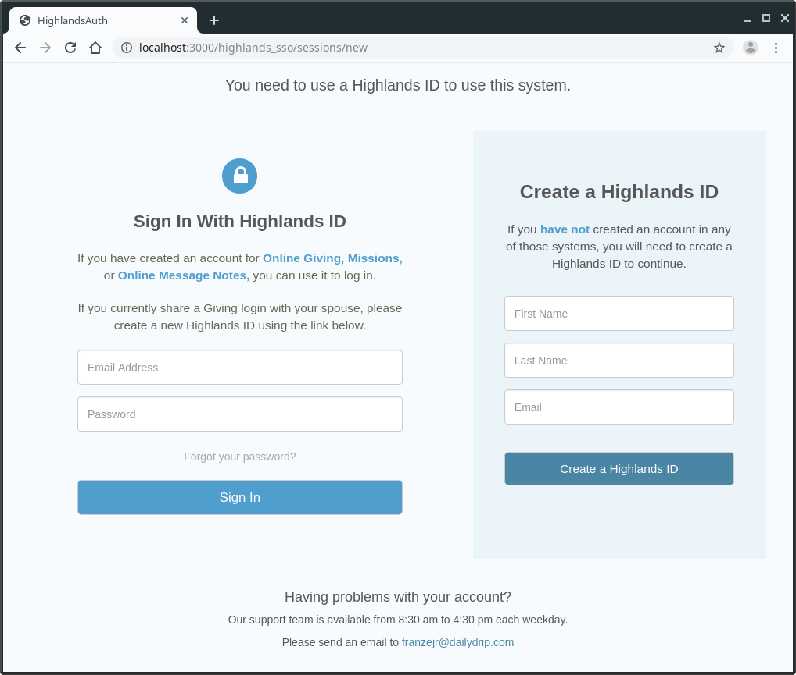

# Uhura

Uhura is a communication system that centralizes communication preferences, policies and statistcs which is comprised of:

* A Ruby on Rails based API server (Uhura) for processing communications

* A UI for the administration of communication functions of Uhura

* A Uhura Ruby gem which can be used to integrate with Rails applications

  


The core of the Uhura system is a Ruby on Rails application, **Uhura Comm Server** in the image above, that provides REST API endpoints for managing and sending messages over email and SMS to Highlands **SSO user**s based on their user preferences. This piece holds all of the ActiveRecord models and manages interfacing with a database, API clients, and message processors, i.e, **Sendgrid** and **Clearstream**. 

Uhura also include a basic **Admin App** for viewing and administrating Uhura's data layer.

The **Uhura Client** (https://github.com/dailydrip/uhura-client), is a Ruby gem provides an API Client for integrating with the message processing system. 

UhuraExampleApp (https://github.com/dailydrip/uhura-example-app) is an example Rails **App**lication that uses the Uhura client gem.


## Getting Started

These instructions will get you up and running with Uhura on your local machine for development and testing purposes. 

## Prerequisites

- Git
- Ruby 2.6.3
- bundler 2.0.2
- PostgreSQL

### Git

Follow the [Connecting to GitHub with SSH](https://help.github.com/en/articles/connecting-to-github-with-ssh) instructions.

#### Ruby 2.6.3

If you might need to install more than one version of Ruby on your server, consider using [<https://github.com/rbenv/rbenv>](https://github.com/rbenv/rbenv) or [rvm](https://rvm.io/) to help you manage your Ruby version.

### bundler 2.0.2

Install the bundler gem, s.t., you can later run the `bundle` command and install Uhura's Ruby dependencies:

``` bash
gem install bundler:2.0.2
```

### PostgreSQL
If you want to install the [PostgreSQL](https://www.postgresql.org/) database sever locally for development purposes you can follow these steps on Ubuntu. 

NOTE: Replace `lex` with your operating system's username below:

``` bash
$ sudo apt update
$ sudo apt install postgresql postgresql-contrib
$ sudo -i -u postgres psql
postgres=# CREATE ROLE lex LOGIN SUPERUSER;
```

Giving your user role the SUPERUSER attribute allows you to run Rails database manipulation commands and migrations, e.g., `bundle exec rake db:create`. The LOGIN attribute is also required.

NOTE: See [Troubleshooting Guide](docs/troubleshooting.md) to see how to install PostgrSQL client library if you chose not to install the PostgreSQL database server in the server instance where you install Uhura.

## Environment Variables

Uhura's environment variables have been divided into two sections.

### Basic Configuration 

Settings that are core to the operation of Uhura: 

- Routing
- Basic Authentication
- Service Timeouts
- PostgreSQL (Database) Access
- Testing
- Logging.

### 3rd Party Services

Environment variables used to integrate with 3rd party services:

- Github Access
- Sendgrid Access
- Clearstream Access
- Highlands SSO Access

### Create Your .env File

See the *Create Your .env File* section below.

### Installation

#### 1. Install Uhura 

Let's assume our uhura project root directory is `~/Projects/uhura`

```bash
$ mkdir ~/Projects
$ cd ~/Projects
$ git clone https://github.com/dailydrip/uhura.git
$ cd uhura
$ bundle
```

#### 2. Create Your .env File

Run the following command and edit your .env file to match your environment.

```bash
mv sample.env .env
```

You can load those environment variables into your terminal's session by sourcing your project's .env file:

```bash
source .env
```

#### 3. Create Uhura Database

If you're installing Uhura in your development environment, ensure that [Postgresql](https://www.postgresql.org/) is installed. Then, from your ~/Projects/uhura directory run the following commands to create the Uhura database:

```bash
$ source .env
$ bundle exec rake db:create db:migrate db:seed
```

#### 4. Add Highlands SSO Admin User

Run the following rake task, replacing the parameters with valid Highlands SSO crendentials, to enable your admin user to login to the [Uhura Admin Application](https://github.com/dailydrip/uhura/blob/master/docs/admin_guide.md).

```bash
$ be rake users:add-admin['admin.name@yourdomain.com','ausername','FirstName','LastName']
**************************************************
⛔️ WARNING: Sidekiq testing API enabled, but this is not the test environment.  
Your jobs will not go to Redis.
**************************************************

Admin Added!
```

#### 5. Run Uhura Server

```bash
$ bundle exec rails server
```

#### 6. Open Admin Application

Go to `http://localhost:3000/admin` and you'll be redirected to login using your Highlands SSO credentials:



Login with your Highlands SSO credentials; the username should match what you used in the **Add Highlands SSO Admin User** section above.


### Tests

#### Unit Tests

We use  `rspec` for running unit tests.. From your ~/Projects/uhura directory, run:

```bash
$ source .env
$ bundle exec rspec
```

#### Project Linter

We use `rubocop` for Ruby linting. From your ~/Projects/uhura directory, run:

```bash
$ bundle exec rubocop
```


### SideKiq

Uhura uses [SideKiq](https://github.com/mperham/sidekiq) for processing messages sent to [Sendgrid](https://sendgrid.com/) and [Clearstream](https://clearstream.io/).  Sidekiq is installed as a Ruby gem and is pre-configured to work with Uhura.

Sidekiq uses [Redis](https://redis.io/) to store all of its job and operational data.

By default, Sidekiq tries to connect to Redis at `localhost:6379`. This typically works great during development but needs [tuning in production](https://github.com/mperham/sidekiq/wiki/Using-Redis).


## Other Resources

See the [Troubleshooting Guide](docs/troubleshooting.md) , [Developers Notes](docs/developer_notes.md) and [Admin Guide](docs/admin_guide.md) in the [documents directory](docs/).

Sendgrid Templates

You can find several example SendGrid template files in the [doc/sendgrid_templates directory](doc/sendgrid_templates directory)


# License

This project is licensed under the MIT License - See the [LICENSE](LICENSE.txt) file for details.