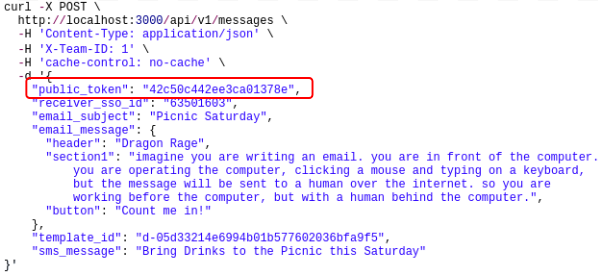
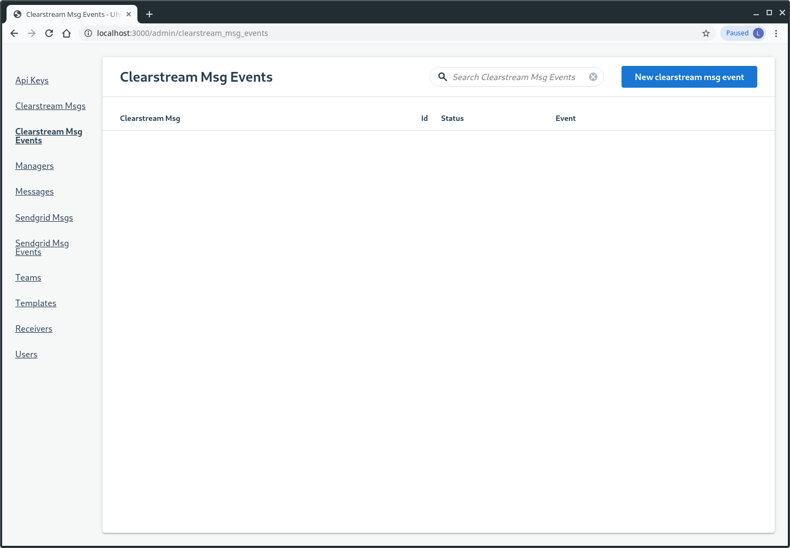

# Uhura Admin Guide

This guide contains screenshots of Uhura's admin application.

First, navigate to where you started the Uhura Messaging Server:

Next, click the *admin application* link.  

The default page for Uhura's admin application is the Managers page.

A manager represents the application that manages this Uhura installation.

In our example, Sample - App 1 is this Uhura instance's managing application.

When the Uhura Client  application, e.g., *Sample - App 1*, sends requests to the Uhura Messaging Server for processing, it passes it's Public Token, e.g., `42c50c442ee3ca01378e` to identify itself.

Please gnore the `{"error"=>"undefined method `receiver_sso_id' for :to_s:Symbol"}` error messages you see here.  They appear only for the few developers, in their development environment, when they happen to be running RubyMine in debug mode.

In case you're wondering, "Why aren't there any Clearstream Msg Events below?"  The answer is, "Because Clearstream waits 30 minutes before processing webhook events."  See the bottom of this guide for a screenshot of what this page looks like after 30 minutes has transpired.

## Delayed Clearstream Webhook Execution

After waiting 30 minutes, we try the Clearstream Msg Events page again and see that the Clearstream web hook has executed and updated this SMS message's status to `SENT`

# License

This project is licensed under the MIT License - See the [LICENSE](LICENSE.txt) file for details.