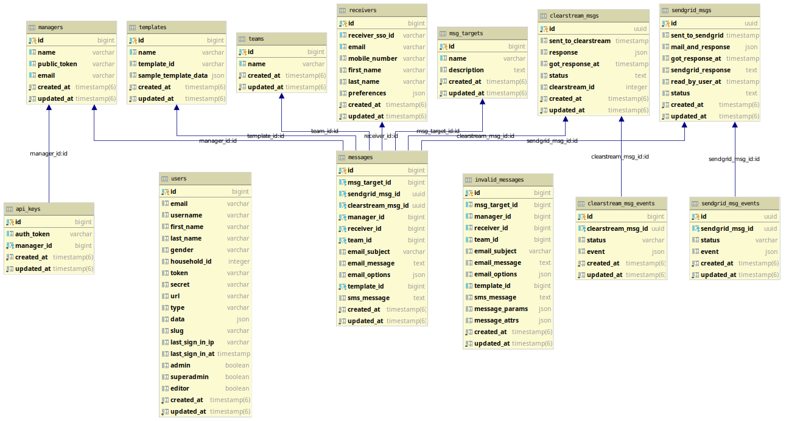
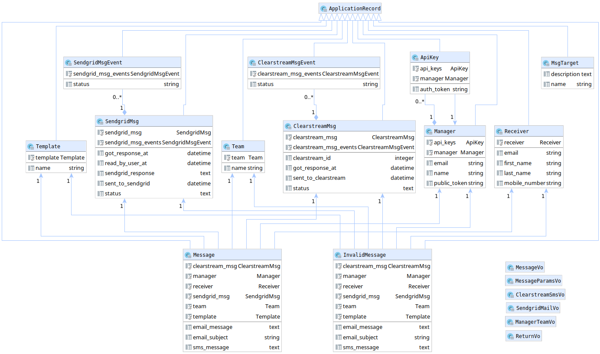
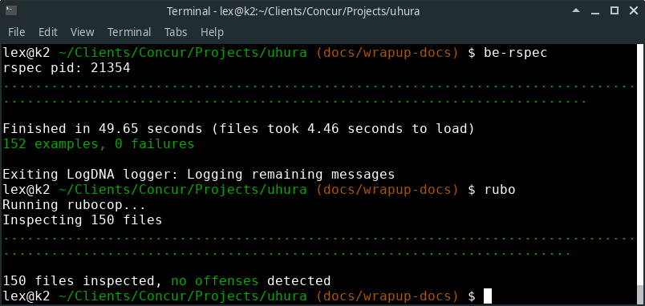

# Uhura Developer Notes

This guide contains information that may be helpful to Ruby developers that are interested in integrating with Uhura into there Ruby-based applications.


## Ruby Style Guide

The coding practices found in the Uhura code base follow the community-driven [Ruby coding style guide](https://rubystyle.guide) and is enforced by the [Rubocop](https://github.com/rubocop-hq/rubocop) linter.


## Uhura Database Schema Diagram




## Uhura Rails Model Dependency Diagram




## External Services

Uhura uses Sendgrid to process emails and Clearstream to process SMS messages.


### Sendgrid

Uhura uses Sendgrid as it's external email processor.

Create an account at https://app.sendgrid.com/ where you can:

- Get an [API key](https://app.sendgrid.com/settings/api_keys) and assign it to the `SENDGRID_API_KEY` environment variable
- Create [Sendgrid templates](https://sendgrid.com/dynamic_templates) (assign it's ID to the`template_id`in your POST)
- View sent email statistics

You may need to create Support Ticket to activate your account:

https://stackoverflow.com/questions/42214048/sendgrid-returns-202-but-doesnt-send-email


### Clearstream

Uhura uses Clearstream as it's external SMS processor.

Create an account at [https://app.getclearstream.com](https://app.getclearstream.com/) where you can:

- Get an [API key](https://app.getclearstream.com/settings/api) and assign it to the `CLEARSTREAM_KEY` environment variable
- Create [webhooks](https://app.getclearstream.com/settings/webhooks) to tell Uhura when Clearstream events occur
- View sent SMS statistics


### Highlands SSO

We used the Administrate gem (https://github.com/thoughtbot/administrate) to help use build the /admin application.

When you access the home pages, for example, http://localhost:3000/admin, in development, you'll be redirected to the Highlands SSO login page (http://localhost:3000/highlands_sso/sessions/new).

If you are a admin or super_admin in the Highlands SSO realm, then after logging in you'll be redirected to the /admin application.

If you are a user, but not an admin, you'll be redirected to the Uhura home page with the following message: You are not authorized to access the admin application.

If your credentials get upgraded to a Highlands SSO admin, you should clear your browser cache, i.e., remove your site cookies and try again.


### Before You Get Access to Highlands SSO

Before integrating with Highlands SSO, you can test Uhura by creating a record in Uhura's `receivers` table.

In Rails console:

```
lex = Receiver.create!(
	receiver: '88543898',
    first_name: 'Lex',
    last_name: 'test',
    email: 'lex@smoothterminal.com',
    mobile_number: '4049196695',
    preferences: {email: false, sms: true}
)
lex.save!

m1 = Manager.first
m1.email = 'app1@example.com'
m1.save!

# Use the following tokens in POST requests:
m1.public_token
m1.api_key.auth_token

```

Use the public_token in in the POST request body to http://localhost:3000/api/v1/messages
Use  the auth_token for the Authorization bearer token value.

#### SendGrid Errors

The Manager.email value must be valid or you'll get a 404 error from SendGrid and clues as to what happened.


## Authentication

To maintain consistency with Exchequer-Server, Uhura implements auth security as follows:

- The message sender is a Manager, which is really an Application (App).
- The Manager identifies itself with a public_token (that's stored in the manager table)
- An auth_token is created when a Manager is created (it's stored in the api_keys table)
- When an application makes a send_message request, it passes the auth_token in the Authorization HTTP header
- The application also sends its public_token in the POST body
- Uhura looks up the application in the Manager table and verifies the auth_token in the api_keys table


## Logger

Given that we can send Rails output logs to external services, we have enabled integration with the LogDNA service.

To enable log statements to be sent to LogDNA set the following environment variables:

```sh
export UHURA_LOGGER='LOGDNA'
export LOG_ENDPOINT='https://logs.logdna.com/logs/ingest'
```

By default, Uhura will format Rails server log output in the Logstash (JSON) format.  Example:

```sh
{"method":"POST","path":"/api/v1/web_hooks/sendgrid","format":"html","controller":"Api::V1::WebHooksController","action":"sendgrid","status":204,"duration":10830.82,"view":0.0,"db":40.17,"@timestamp":"2019-07-19T01:56:14.264Z","@version":"1","message":"[204] POST /api/v1/web_hooks/sendgrid (Api::V1::WebHooksController#sendgrid)"}
```


## Value Objects and Render Helpers

Uhura uses value objects (VO), e.g., `MessageVo`.  VO's include the ActiveModel class to leverage it's validations.

### POST method for MessagesController

```
  def create
    if (err = validate_params)
      render_error_msg(err)
    else
      message_vo = MessageVo.new(message_params_vo, manager_team_vo)
      if message_vo.errors.present?
        render_message_error(message_vo)
      elsif !message_vo.valid?
        render_message_error(message_vo)
      else
        render_message(MessageDirector.send(message_vo))
      end
    end
  end
```

### Render Helpers

Uhura also includes helpers, e.g., `render_message_error` to simplify controller logic:

#### render_message_error

```
  def render_message_error(message_vo)
    errors = message_vo.errors.messages.values.squash if message_vo&.errors&.messages
    invalid_message = InvalidMessage.create!(
      message_vo.invalid_message_attrs.merge(
        message_params: message_params_vo.message_params,
        message_attrs: message_vo.to_hash.merge(errors: errors)
      )
    )
    render_error_status(invalid_message.id)
  end
```

#### render_message

```
  def render_message(ret_sendgrid_and_clearstream)
    render json: {
      sendgrid_msg: ret_sendgrid_and_clearstream[:sendgrid],
      clearstream_msg: ret_sendgrid_and_clearstream[:clearstream]
    }
  end

```


### ReturnVo

`ReturnVo` is another value object that Uhura uses to pass data back to a caller.

```
class HighlandsHandler < ServiceHandlerBase
  # This is a synchronous call
  def get_user_preferences(data)
    data = data[:highlands_data]
    response = HighlandsClient::MessageClient.new(
      data: data,
      resource: data[:resource]
    ).get_user_preferences(data[:id])
    preferences = Receiver.convert_preferences(response['preferences'])
    return ReturnVo.new_value(clearstream_msg: clearstream_msg) if preferences.present?

    ReturnVo.new_err(clearstream_msg.errors || "No user_preferences found for id (#{data[:id]})")
  end
end

```

The idea behind a `ReturnVo` is that a response is either successful, in which it returns a value...

```
  def self.new_value(value_hash)
    new(value: return_accepted(value_hash), error: nil)
  end
```

... or it's not successful, in which it returns an error:

```
  def self.new_err(err)
    new(value: nil, error: return_error(err, :unprocessable_entity))
  end
```


### ReturnVo Examples

A return value object has two attributes: value and error.
Both value and error return a hash; This allows for a consistent response object.

#### Error

Here's an example of an error:

```
{
    "status": 422,
    "data": null,
    "error": "Team name (X-Team-ID HTTP header) STA NOT found!"
}
```

#### Success

Here's a success.  Note the consistency in the format of the response (both error and success responses have same hash keys).

Clearstream Response

```
{
    "status": 202,
    "data": {
        "clearstream_msg": "{\"id\":10,\"sent_to_clearstream\":\"2019-05-15T13:49:14.326Z\",\"sms_json\":\"{\\\"data\\\":{\\\"id\\\":118487,\\\"status\\\":\\\"QUEUED\\\",\\\"sent_at\\\":\\\"2019-05-15T13:49:55+00:00\\\",\\\"completed_at\\\":null,\\\"text\\\":{\\\"full\\\":\\\"Leadership Team: Come in now for 50% off all rolls!\\\",\\\"header\\\":\\\"Leadership Team\\\",\\\"body\\\":\\\"Come in now for 50% off all rolls!\\\"},\\\"lists\\\":[],\\\"subscribers\\\":[\\\"+17707651573\\\"],\\\"stats\\\":{\\\"recipients\\\":1,\\\"failures\\\":0,\\\"throughput\\\":0,\\\"replies\\\":0,\\\"opt_outs\\\":0},\\\"social\\\":{\\\"twitter\\\":{\\\"enabled\\\":false,\\\"id\\\":null,\\\"url\\\":null},\\\"facebook\\\":{\\\"enabled\\\":false,\\\"id\\\":null,\\\"url\\\":null}}}}\",\"got_response_at\":\"2019-05-15T13:49:14.571Z\",\"clearstream_response\":\"QUEUED\",\"created_at\":\"2019-05-15T13:49:14.335Z\",\"updated_at\":\"2019-05-15T13:49:14.571Z\"}"
    },
    "error": null
}
```

#### Sendgrid Success Response

```
{
    "status": 202,
    "data": {
        "sendgrid_msg": "{\"id\":6,\"sent_to_sendgrid\":\"2019-05-15T19:35:09.555Z\",\"mail_json\":{\"from\":{\"email\":\"app1@highlands.org\"},\"subject\":\"Picnic Saturday Week\",\"personalizations\":[{\"to\":[{\"email\":\"bob.p.k.brown@gmail.com\",\"name\":\"Bob Brown\"}],\"dynamic_template_data\":{\"header\":\"Karate Chop\",\"section1\":\"Try to imagine all life as you know it stopping instantaneously and every molecule in your body exploding at the speed of light.\",\"section2\":\"Maybe now you'll never slime a guy with a positron collider, huh?\",\"section3\":\"You will perish in flame, you and all your kind! Gatekeeper!\",\"button\":\"Reply\",\"email_subject\":\"Picnic Saturday Week\"}}],\"template_id\":\"d-f986df533e514f978f4460bedca50db0\"},\"got_response_at\":\"2019-05-15T19:35:09.639Z\",\"sendgrid_response\":\"202\",\"read_by_user_at\":null,\"created_at\":\"2019-05-15T19:35:09.555Z\",\"updated_at\":\"2019-05-15T19:35:09.639Z\"}"
    },
    "error": null
}
```


## Response Examples

A single call to the Uhura messages API calls both Sendgrid (Email) and Clearstream (SMS).

### Response for message to receiver, whose preferences indicate they only want to get Email messages:

```
{
    "sendgrid_msg": {
        "value": {
            "status": 202,
            "data": {
                "sendgrid_msg": "Asynchronously sent email: (Leadership Team:Picnic Saturday) from (Sample - App 1) to (bob@example.com <Bob Example>)"
            },
            "error": null
        },
        "error": null
    },
    "clearstream_msg": null
}
```

### Response for message to receiver, whose preferences indicate they only want to get SMS messages:

```
{
    "sendgrid_msg": null,
    "clearstream_msg": {
        "value": {
            "status": 202,
            "data": {
                "clearstream_msg": "Asynchronously sent SMS: (Leadership Team:Picnic Saturday) from (Sample - App 1) to (9999999999)"
            },
            "error": null
        },
        "error": null
    }
}
```

### Response for message to receiver, whose preferences indicate they want both Email messages and SMS messagess:

```
{
    "sendgrid_msg": {
        "value": {
            "status": 202,
            "data": {
                "sendgrid_msg": "Asynchronously sent email: (Leadership Team:Picnic Saturday) from (Sample - App 1) to (bob@example.com <Bob Example>)"
            },
            "error": null
        },
        "error": null
    },
    "clearstream_msg": {
        "value": {
            "status": 202,
            "data": {
                "clearstream_msg": "Asynchronously sent SMS: (Leadership Team:Picnic Saturday) from (Sample - App 1) to (9999999999)"
            },
            "error": null
        },
        "error": null
    }
}
```

### Response for message to receiver, whose preferences indicate they want both Email messages and SMS messagess (with invalid SMS):

```
{
    "sendgrid_msg": {
        "value": {
            "status": 202,
            "data": {
                "sendgrid_msg": "Asynchronously sent email: (Leadership Team:Picnic Saturday) from (Sample - App 1) to (cindy.smyth@protonmail.com <Charles Jarrett>)"
            },
            "error": null
        },
        "error": null
    },
    "clearstream_msg": {
        "value": null,
        "error": {
            "status": 422,
            "data": null,
            "error": {
                "msg": "At least one of the supplied subscribers is invalid.",
                "action_required:": {
                    "error_from_clearstream": "At least one of the supplied subscribers is invalid.",
                    "assumed_meaning": "This receiver w/ mobile_number (999-999-ABC!) not registered in Clearstream",
                    "action": "Research whether receiver_sso_id (99999999) is valid."
                }
            }
        }
    }
}
```


### Uhura's Messages API 

Uhura provides a single API endpoint (/api/v1/messages) for submitting messages.

And one API for checking on message statuses (/api/v1/message_status/${MESSAGE_ID})

#### Target Determination

- It's not possible to determine the target (SMS/Email) from the request.
- The Receiver's `preferences` tells Uhura where to send the message
  Example: This receiver gets SMS only:  `{"email"=>false, "sms"=>true}` 

#### Email Message

- The body of the POST below is for an email that has one section.
  The template_id identifies a SendGrid html template that has one section.
- Change the Host address `localhost:3000` to your Uhura host server address.

```
export X_TEAM_ID=1
export UHURA_AUTORIZATION_TOKEN=dead0dead1dead2dead3
export BODY='{
	"public_token": "deadbeef00deadbeef01",
    "receiver_sso_id": "55357499",
    "email_subject": "Picnic Saturday",
    "email_message": {
	  "header": "Dragon Rage",
	  "section1": "imagine you are writing an email. you are in front of the computer. you are operating the computer, clicking a mouse and typing on a keyboard, but the message will be sent to a human over the internet. so you are working before the computer, but with a human behind the computer.",
	  "button": "Count me in!"
	},
    "template_id": "d-0ce0d614007d4a72b8242838451e9a65",
    "sms_message": "Bring Drinks to the Picnic this Saturday"
}'
export UHURA_HOST="http://localhost:3000"

curl -X POST \
  -H "X-Team-ID: $X_TEAM_ID" \
  -H "Authorization: Bearer $UHURA_AUTORIZATION_TOKEN" \
  -H "Content-Type: application/json" \
  -H "cache-control: no-cache" \
  -d "$BODY" \
  $UHURA_HOST/api/v1/messages
```

##### Email message with two sections

The message BODY below is sent to a SendGrid template (d-2a5278f48f0c41b992509f4039614930) that expects two sections:

```
{
	"public_token": "{{UHURA_PUBLIC_TOKEN}}",
    "receiver_sso_id": "88543891",
    "email_subject": "Picnic Next Saturday",
    "email_message": {
	  "header": "Bind",
	  "section1": "You're more like a game show host.",
	  "section2": "I think we can get her a guest shot on 'Wild Kingdom.' I just whacked her up with about 300 cc's of Thorazaine... she's gonna take a little nap now.",
	  "button": "Action!"
	},
    "template_id": "d-2a5278f48f0c41b992509f4039614930",
    "sms_message": "Bring Dessert to the Picnic Next Saturday"
}
```


## Response Examples

#### Successful Response

```
{
  "status": 200,
  "data": {
    "message": "We got the message. Go here (http://localhost:3000/api/v1/message_status/29) for details on it later."
  },
  "error": null
}
```

#### Failed Response

```
{
  "status": 422,
  "data": null,
  "error": {
    "message": "Team ID (-Team-ID) from the X-Team-ID HTTP header NOT found! Consider adding Team for ID (-Team-ID) using the Admin app on the Teams page."
  }
}
```


## Message Table

The messages table has two fields that represent a messaage sent to Uhura's external message processors (Sendgrid and Clearstrram)

For example, once the message has been sent to Sendgrid, the sendgrid_msg_id field will be populated/linked to the SendgridMsg table entry. 

Since both sendgrid_msg_id and clearstream_msg_id are non-null, we know that the receiver's user communication preferences indicated that they wish to receive messages to both Email and SMS.

```
{
  "id": 1,
  "sendgrid_msg_id": "95531ecf-ebb6-4b7d-824e-43e529757939",
  "clearstream_msg_id": "c56a9642-9e0d-40fe-bead-d4c5370109b7",
  "manager_id": 1,
  "receiver_id": 4,
  "team_id": 1,
  "email_subject": "Picnic Saturday",
  "email_message": "{\"header\"=>\"Dragon Rage\", \"section1\"=>\"imagine you are writing an email. you are in front of the computer. you are operating the computer, clicking a mouse and typing on a keyboard, but the message will be sent to a human over the internet. so you are working before the computer, but with a human behind the computer.\", \"button\"=>\"Count me in!\"}",
  "email_options": null,
  "template_id": 1,
  "sms_message": "Bring Drinks to the Picnic this Saturday",
  "created_at": "2019-08-12T21:10:24.915Z",
  "updated_at": "2019-08-12T21:10:25.480Z"
}
```


## Receiver Table

Receivers are added to the receivers table the first time Uhura receives a request to send that receiver a message. Subsequent messages will find that receivers's record and update it's attributes if there have been any changes.

### Example Receiver

This receiver "Alice Green" prefers to receive only SMS messages:

```
{
                 :id => 1,
    :receiver_sso_id => 34430309,
              :email => "alice@aol.com",
      :mobile_number => "9999999999",
         :first_name => "Alice",
          :last_name => "Green",
        :preferences => {
        :email => false,
          :sms => true
    },
         :created_at => "2019-08-12T20:15:01.297Z",
         :updated_at => "2019-08-12T20:15:01.297Z"
}

```


## Aliases for Rspec and Rubocop

Here's what it looks like to run Uhura's specs and linter:



Here're the aliases used:

```
alias be-rspec='ps -ef | grep -v grep|grep "\/rspec" | while read line; do pid2kill="$(echo \"$line\" | awk '\''{print $2}'\'')"; if [ "$pid2kill" != "" ]; then kill -9 $pid2kill; fi; done; bundle exec rspec'
lex@k2 ~ $ alias | grep rubo

alias be='bundle exec'

alias rubo='echo "Running rubocop..."; be rake rubocop'
```


# License

This project is licensed under the MIT License - See the [LICENSE](LICENSE.txt) file for details.